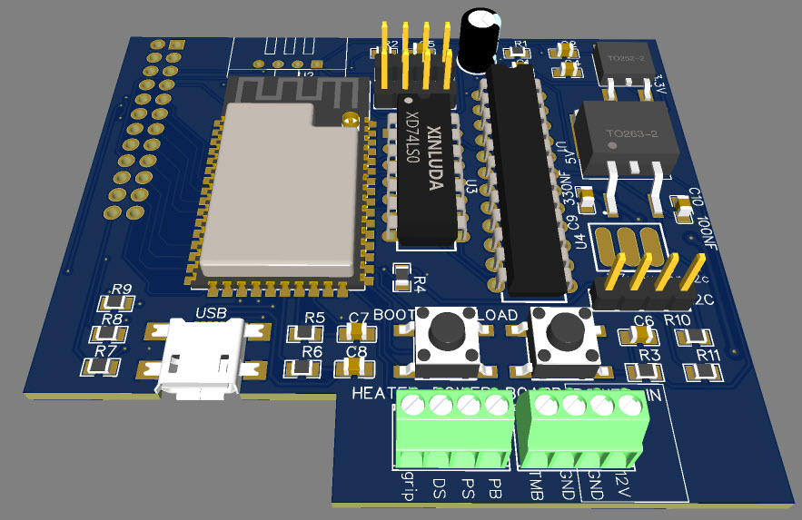
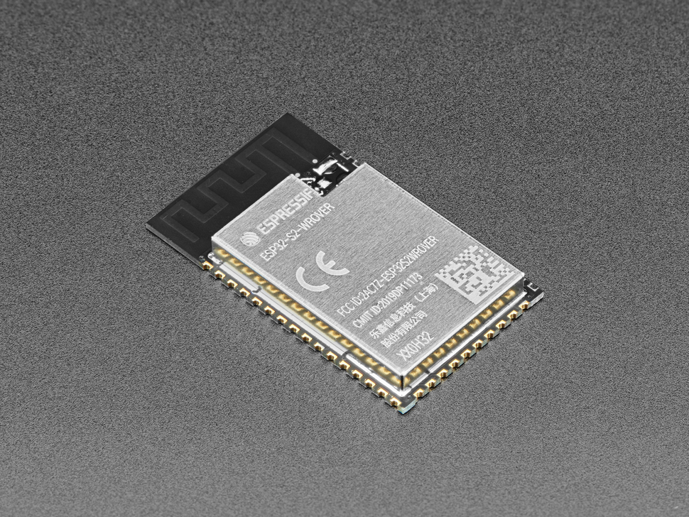
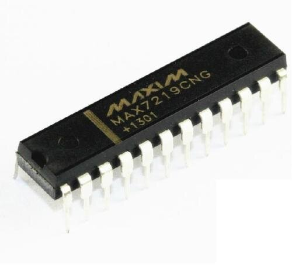
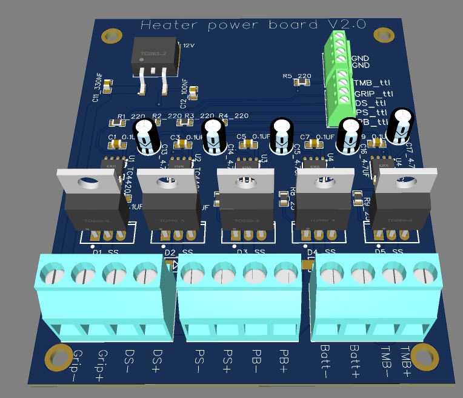
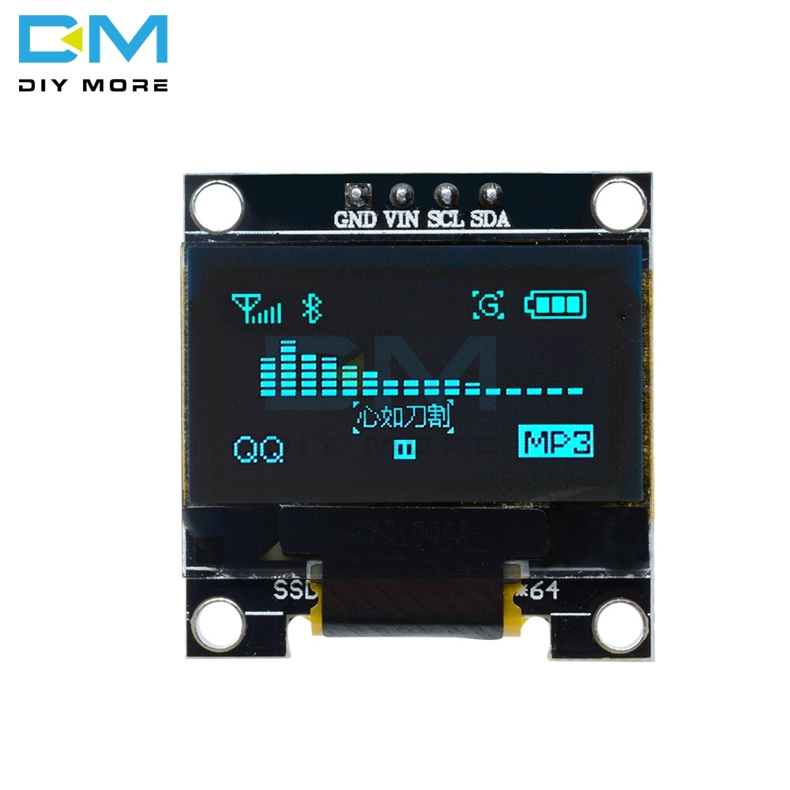

| Supported Targets | ESP32-S2 |
| ----------------- | -------- |

Note: Display control with LVGL is based on [LVGL v7](https://github.com/lvgl/lvgl/releases/tag/v7.11.0) in the [port for ESP32](https://github.com/lvgl/lv_port_esp32)

# Functional description
On/off button:
-When power is applied, on/off state is remembered, hence if button is off before previous power off, system is off when power is applied again.
-Long press: increment LED brightness in 5 steps

Mode button:
-Toggles between Auto, Manual and Dewpoint mode

Grip/throttle button:
-Press: Grips/throttle power level

Other buttons:
-Set power levels on press

Auto mode:
- inputs: Temp and Relative humidity.
-- Temp array give input to power level
-- Relative humidity > 90% set 100% power level or whatever temp array demands if humidity< 90%

Manual mode:
-All settings are set manual, settings are remembered between power cycles

Dewpoint mode:
-input: Relative humidity
-- Relative humidity > 90% set 100% power level, else off

# Hardware layout
The touch element board is connected to the control board via a pin header and is one module when plugged together. 
The power board is located separately via wires and supply power to the heating elements. 
[Gerber files](gerber_files)
## Touch element board
This is the human interface with touch sensors and LEDs to display power levels and chosen mode

### Touch elements
Touch Element hardware is designed based on [Espressifs Touch Element waterproof Example](https://docs.espressif.com/projects/esp-idf/en/latest/esp32s2/api-reference/peripherals/touch_element.html)

### Indicator leds
The power levels matrix is driven by max7219 chip with driver from [ESP-IDF-LIB](https://esp-idf-lib.readthedocs.io/en/latest/groups/max7219.html)

## Control board
The microcontroller reads the user input from the touch elements and output signals for the power board and LEDs on the touch element board.

### ESP32S2 Wrover

[ESP32S2 Wrover datasheet](https://www.espressif.com/sites/default/files/documentation/esp32-s2-wrover_esp32-s2-wrover-i_datasheet_en.pdf)

### DHT22 temp and humidity sensor

[dht22 datasheet](https://www.sparkfun.com/datasheets/Sensors/Temperature/DHT22.pdf)

### Max7219 LED driver

[max7219 datasheet](https://datasheets.maximintegrated.com/en/ds/MAX7219-MAX7221.pdf)

## Power board
The power levels are controlled via PWM signals from the control board to the power board.

## OLED display
ssd1306 128x64 i2c OLED is used to display temperature and relative humidity
