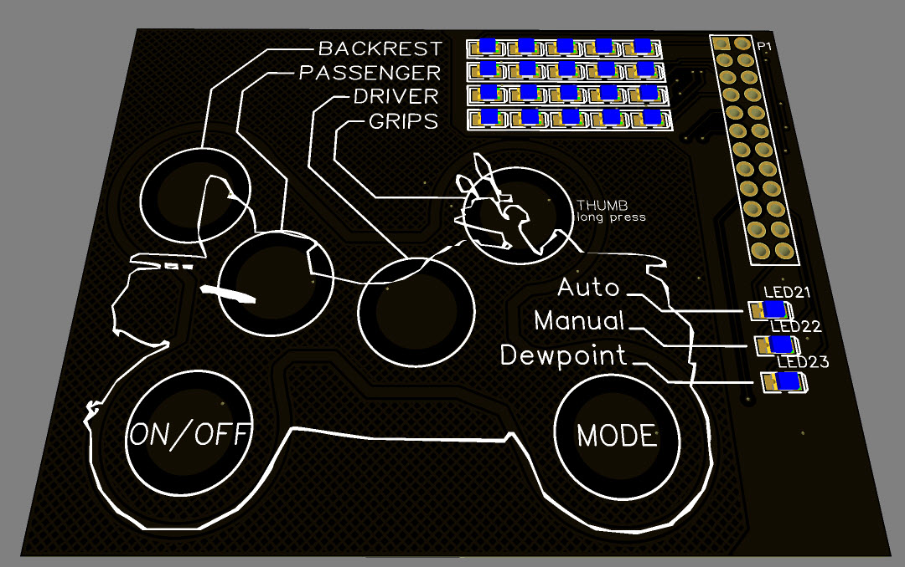

| Supported Targets | ESP32-S2 |
| ----------------- | -------- |

# Functional description
On/off button:
-When power is applied, on/off state is remembered, hence if button is off before previous power off, system is off when power is applied again.
-Long press: increment LED brightness in 5 steps

Mode button:
-Toggles between Auto, Manual and Dewpoint mode

Grip/throttle button:
-Press: Grips/throttle power level

Other buttons:
-Set power levels on press

Auto mode:
- inputs: Temp and Relative humidity.
-- Temp array give input to power level
-- Relative humidity > 90% set 100% power level or whatever temp array demands if humidity< 90%

Manual mode:
-All settings are set manual, settings are remembered between power cycles

Dewpoint mode:
-input: Relative humidity
-- Relative humidity > 90% set 100% power level, else off

# Hardware layout
The touch element board is connected to the control board via a pin header and is one module when plugged together. 
The power board is located separately via wires and supply power to the heating elements. 

## Touch element board

### Touch elements
Touch Element hardware is designed based on [Espressifs Touch Element waterproof Example](https://docs.espressif.com/projects/esp-idf/en/latest/esp32s2/api-reference/peripherals/touch_element.html)

### Indicator leds
power levels matrix are driven by max7219 driver from [ESP-IDF-LIB](https://esp-idf-lib.readthedocs.io/en/latest/groups/max7219.html)

## Control board
### ESP32S2 Wrover

### Temp and humidity sensor

### Max7219 LED driver

## Power board
The power levels are controlled via PWM signals from the control board to the power board.
### Hardware description 